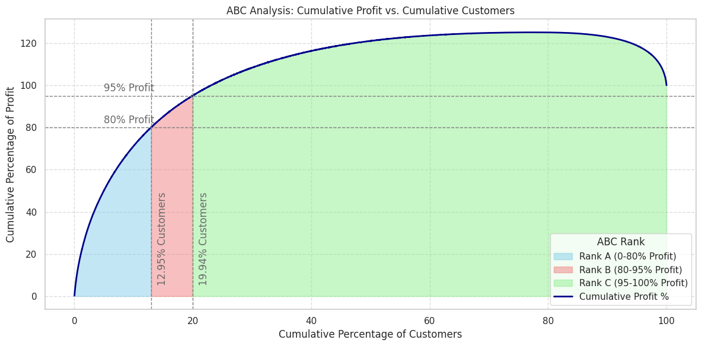
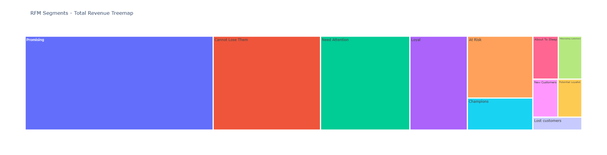
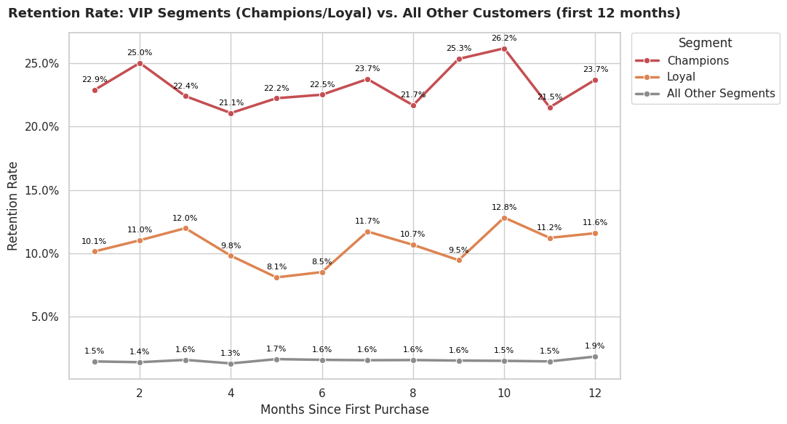
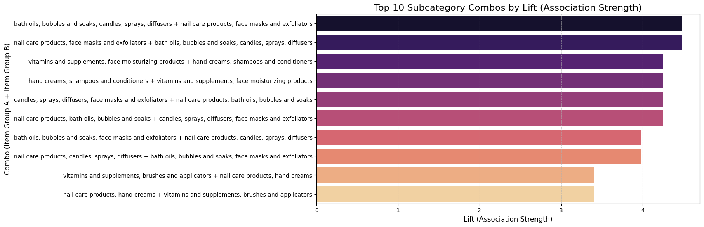

# 🌸 CosmeticWorld — Customer Segmentation & Market Basket Analysis

A two-part Python analytics project on a global beauty & body care retailer's transaction
data — ABC/RFM/Cohort segmentation to decide **who** gets a VIP gift set, and Market Basket
Analysis to decide **what** gets bundled and cross-sold.

---

## 📌 Table of Contents

1. [Project Overview](#-project-overview)
2. [Dataset Architecture](#-dataset-architecture)
3. [Data Wrangling and Pipeline Cleanliness](#data-wrangling-and-pipeline-cleanliness)
4. [Exploratory Data Analysis & Visualizations](#-exploratory-data-analysis--visualizations)
5. [Key Tactical Insights](#-key-tactical-insights)
6. [Tech Stack & Execution Environment](#-tech-stack--execution-environment)

---

## 🎯 Project Overview

This repository analyzes CosmeticWorld's transaction history (**51,290 line items**, 17,415
customers) to support the "New Year Rejuvenation 2024" campaign. `01_abc_rfm_cohort_analysis`
combines Pareto/ABC profitability ranking with RFM behavioral segmentation to shortlist 500 VIP
gift recipients, then checks whether retention actually differs by segment. `02_market_basket_
analysis` reuses the same cleaned data to mine product co-purchase patterns with Apriori and
FP-Growth, recommending specific bundles.

---

## 📁 Dataset Architecture

Four relational tables, joined on `CustomerID` / `ProductCode` / `RegionCode`:

| Table | Description | Key Columns |
|------|-------|---------------|
| `EcomSales.csv` | Transaction history | OrderID, ProductCode, CustomerID, Sales, Discount, Profit |
| `Customer.csv` | Customer demographics | CustomerID, Segment, Income Group, Gender |
| `Product.csv` | Product catalog | ProductCode, Category, Subcategory |
| `Region.csv` | Geographic reference | RegionCode |

---

## Data Wrangling and Pipeline Cleanliness

- **Duplicate handling:** `EcomSales` had 102 rows duplicated on the business key
  `(OrderID, ProductCode)`, deduplicated and aggregated before any joins.
- **Missing values:** `Customer.Gender` (124 missing) imputed before merging.
- **Single merge pipeline:** Sales → Product → Customer feeds ABC, RFM, and Cohort analysis
  from one consistent `df_master`, exported for reuse in the Market Basket notebook.
- **Market Basket-specific checks:** a reusable `cleaning_dataframe()` function is re-run
  after the merge (keyed on the business key) since a join can introduce duplication a
  pre-merge check can't catch.

---

## 📊 Exploratory Data Analysis & Visualizations

### 1. ABC / Pareto Profitability Analysis
Customers ranked by cumulative profit contribution:
- **Tier A (Vital Few):** 2,254 customers (12.9%) — ~80% of total profit
- **Tier B:** 1,217 customers (7.0%)
- **Tier C:** 13,944 customers (80.1%)

### 2. RFM Behavioral Segmentation
11 segments from Recency/Frequency/Monetary scores. Largest: Promising (4,321), New Customers
(2,776). Smallest, highest-value: Champions (155), Loyal (473).

### 3. Cohort Retention Analysis
Retention was cut four ways — by acquisition month, Consumer vs Corporate, income group, and
VIP status (Champions/Loyal vs. everyone else) — to find where retention differs. The result
across all four cuts: it mostly doesn't. Monthly retention stays in a flat ~0.4%–4.5% band
almost everywhere; segment and income lines cross back and forth with no consistent winner,
and calendar-month spikes don't hold up once cohort size is accounted for. The one real
separation is VIP status, shown below — and even that comes with a caveat, see Key Tactical
Insights.

### 4. Market Basket Analysis (Apriori + FP-Growth)
Association rules mined at the Subcategory level, cross-validated across both algorithms.

---

## 💡 Key Tactical Insights

- **Profitability alone isn't a fine enough filter.** Tier A (2,254 customers) is far larger
  than the 500-gift-set budget — cross-referencing with RFM (Champions/Loyal) is what actually
  narrows it down to a defensible shortlist.
- **Retention is a broad-based problem, not a segment-specific one.** Across acquisition
  cohort, Consumer/Corporate, and income group, no cut explains meaningfully more retention
  than another — Champions/Loyal is the only real exception, and even that is partly
  definitional (the RFM label itself is built from repeat-purchase history). This points
  toward one unified fix (e.g. an automated post-purchase journey) rather than a separate
  retention campaign per segment.
- **Strongest product combo:** `bath oils/candles/diffusers` ↔ `nail care + face masks`
  (lift ≈ 4.48), found independently by both Apriori and FP-Growth — read as a "home spa"
  self-care routine, packaged into a "Self-Care Kit" bundle recommendation.
- **Association ≠ causation.** The bundle recommendation is a hypothesis to A/B test, not a
  guaranteed revenue lift — see the Limitations section in the Market Basket notebook.

---

## 💻 Tech Stack & Execution Environment

- **Language:** Python 3.x
- **Core Libraries Used:**
  * `pandas`, `numpy` — data wrangling and transformation
  * `matplotlib`, `seaborn`, `plotly.express` — visualization
  * `mlxtend` — Apriori, FP-Growth, and association rule mining
- **Environment Compatibility:** Built on Google Colab (Drive-mounted paths); adaptable to
  local Jupyter runtimes.
